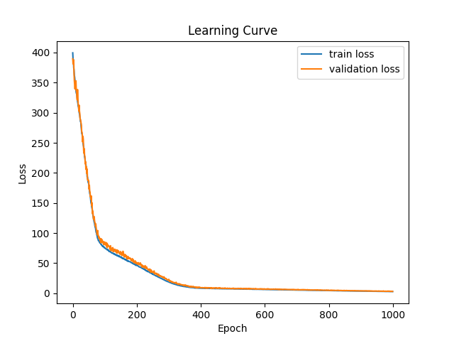

# COVID-19-Cases-Prediction

## Introduction

This project demonstrates the practice of DVC (Data Version Control) as a realization of MLOps, and shows how to develop a machine learning project in a structural way.

This project also demonstrates the usage of simple DNN (deep neural network) with Pytorch. Notice that since achieving the best performance is not the main goal, there is still room to increase the performance by tuning the hyperparameters.

This project tries to predict the percentage of new tested positive cases in the 3rd day given the survey results in the past 3 days in a specific state in U.S. The dataset comes from [here](https://www.kaggle.com/competitions/ml2023spring-hw1).

## Environment

If you want to reproduce my result or start new experiments based on my result, follow the instructions below.

Prerequisites: python3.8

### 1. Fork / Clone this repository

```bash
git clone https://github.com/boruyang/COVID-19-Cases-Prediction.git
cd COVID-19-Cases-Prediction
```

### 2. Create and activate virtual environment

Create virtual environment named `venv` (you may use other name).

```bash
python3 -m venv venv
echo "export PYTHONPATH=$PWD" >> venv/bin/activate
source venv/bin/activate
```

Install python libraries.

```bash
pip install --upgrade pip
pip install -r requirements.txt
```

### 3. Run the overall pipeline

Run `dvc repro` to go over the data pipeline.

Then run `dvc exp show` to see the most recent result and the result commited by git.

If you want to run the overall pipeline manually, run the following scripts.

```bash
python src/stage/load_data.py
python src/stage/generate_dataset.py --config=params.yaml
python src/stage/train.py --config=params.yaml
python src/stage/evaluate.py --config=params.yaml
```

## Project Structure

    .
    ├── .dvc                 # DVC configuration
    ├── data
    │   ├── processed        # The directory storing processed data
    │   └── raw              # The directory storing raw data
    ├── model                # The directory storing models
    ├── report               # The directory containing metrics and prediction
    ├── src
    │   ├── stage            # The py scripts making up the data pipeline
    │   └── util             # The modules used in the py scripts at src/stage
    ├── .dvcignore
    ├── .gitignore
    ├── dvc.lock             # The snapshot of the pipeline information commited by git
    ├── dvc.yaml             # The configuration controlling how DVC run the pipeline
    ├── learning_curve.png   # The learning curve generated by the most recent run pipeline
    ├── params.yaml          # All (hyper)parameters configuration
    ├── README.md
    └── requirements.txt

## Current Result

* train MSE: 2.8390
* validation MSE: 3.1881

